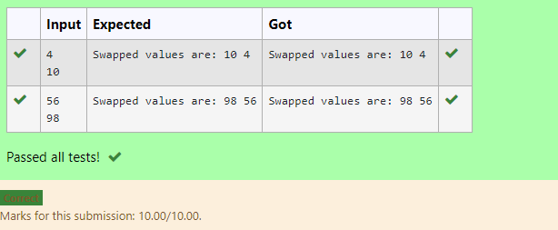

# Swapping-two-values
## AIM:
To write a python program for swapping of two values
## EQUIPEMENT'S REQUIRED: 
PC
Anaconda - Python 3.7
## ALGORITHM: 
### Step 1:
Get the two values from the user
### Step 2: 
Assign the value of second variable to a temporary variable 
### Step 3: 
Assign the value of the first variable to the second variable.
### Step 4:  
Assign the value in temporary variable to the first variable
### Step 5: 
Print both the values it would be interchanged
### Step 6: 
End the program
## PROGRAM:
<<<<<<< HEAD
~~~
#Program to swap two values.
#Developed by: Aadheeshwar.A
#RegisterNumber:21001368
=======
'''
#Program to swap two values.
#Developed by:Jeswanth 
#RegisterNumber:21001768
>>>>>>> 92cfccd3764e4a4408101aab0f4747bfd46d2731
a=int(input())
b=int(input())
a,b=b,a
print("Swapped values are:",a,b)
<<<<<<< HEAD
~~~

## output:

## RESULT:
Thus the swapping of two values are successfully executed

